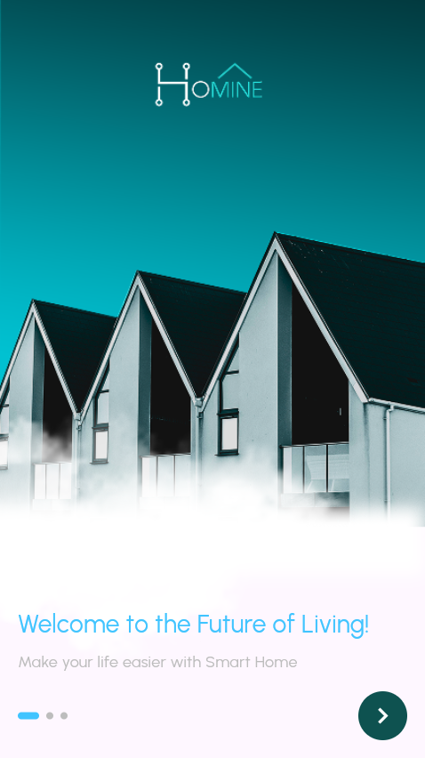
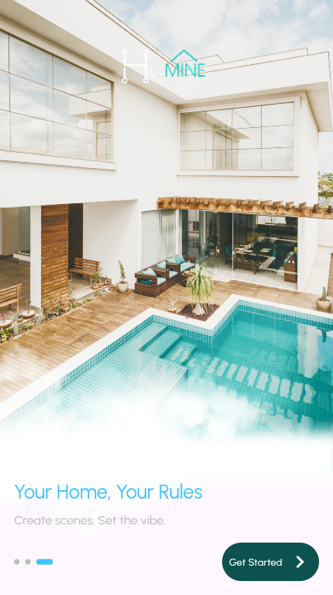
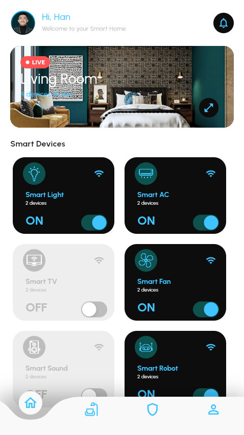
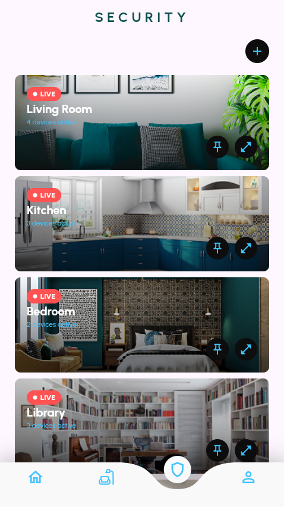
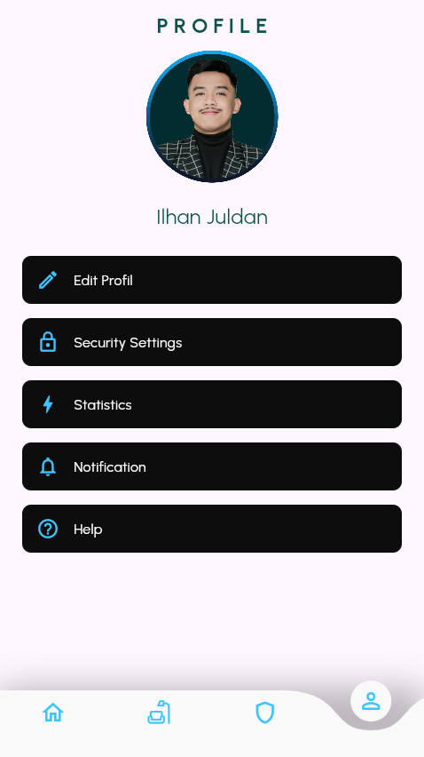
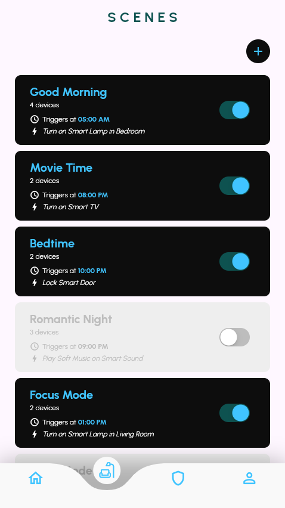

# Homine – Smart Home App

A modern and minimalistic smart home mobile app built with Flutter.

---

## 🚀 Features

- ✨ Futuristic UI with Material 3
- 🎯 Onboarding experience with smooth indicators
- 🏠 Pages for Home, Scenes, Security, and Profile
- 🔠 Stylish Urbanist font for elegant readability
- 📱 Responsive design for various screen sizes

---

## 🖼️ Screenshots

| Onboarding 1 | Onboarding 2 | Home Page |
|--------------|--------------|-----------|
|  |  |  |

| Security Page | Profile Page | Scenes Page |
|---------------|--------------|--------------|
|  |  |  |

---

## 🛠️ Tech Stack

- **Flutter** & **Dart**
- **Material 3** Design System
- **Google Fonts** – Urbanist
- **PageView & SmoothPageIndicator**
- **Custom Navigation Routing**

---

## 📦 Installation

1. Clone this repo  
   `git clone https://github.com/yourusername/homine-smart-home.git`

2. Navigate into the project folder  
   `cd homine-smart-home`

3. Install dependencies  
   `flutter pub get`

4. Run the app  
   `flutter run`

---

